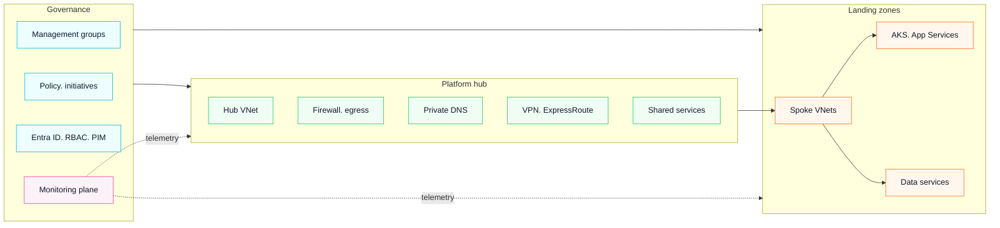

{
  "extends": "./tsconfig.json",
  "compilerOptions": {
    "outDir": "./out-tsc/app",
    "types": []
  },
  "files": [
    "src/main.ts",
    "src/polyfills.ts"
  ],
  "include": [
    "src/**/*.d.ts"
  ]
}

# Azure Enterprise Landing Zone

Production-ready skeleton for deploying an **Azure Enterprise Landing Zone** with **Terraform**. Governance-first. Modular. CI/CD friendly.

## Governance-first architecture (compact)



### Diagram sources
- Mermaid source: `diagrams/architecture.mmd`
- Icon-based version (optional): `diagrams/enterprise-landing-zone.png` (export from diagrams.net / draw.io)

## Project structure

```
azure-enterprise-landing-zone/
├── modules/
│   ├── core/         # Management groups, subscriptions, baseline
│   ├── identity/     # RBAC assignments, Entra patterns
│   ├── network/      # Hub-spoke, DNS, routing, NSGs
│   ├── security/     # Policy sets, guardrails, defender baselines
│   └── monitoring/   # Diagnostics, Log Analytics, alerts
├── environments/     # env wrappers (dev, prod, etc.)
├── pipelines/        # CI/CD examples
└── diagrams/         # Mermaid + draw.io exports
```

## What this repo is (and is not)
- **Is**: a clean, reusable baseline you can explain in interviews. Governance-first. Enterprise patterns.
- **Is not**: a full CAF reference implementation with every optional component baked in.

## Quick start

```bash
git clone https://github.com/gowrishacv/azure-enterprise-landing-zone.git
cd azure-enterprise-landing-zone
cd environments/dev
az login
terraform init
terraform plan -out=tfplan
terraform apply tfplan
```

## draw.io icon diagram. Setup checklist
1. Open diagrams.net (draw.io)
2. More Shapes… enable **Azure** icon libraries
3. Create 3 containers: Governance. Platform hub. Landing zones
4. Save source: `diagrams/enterprise-landing-zone.drawio`
5. Export PNG (2x or 3x): `diagrams/enterprise-landing-zone.png`
6. Add the PNG below the Mermaid diagram if you want a recruiter-friendly view

## Roadmap
- Add policy initiative examples (security baseline)
- Add remote state pattern per environment
- Add private endpoint patterns for common services
- Add workload example (AKS) aligned to hub-spoke

## Author
Gowrisha CV. LinkedIn: https://www.linkedin.com/in/gowrishacv/