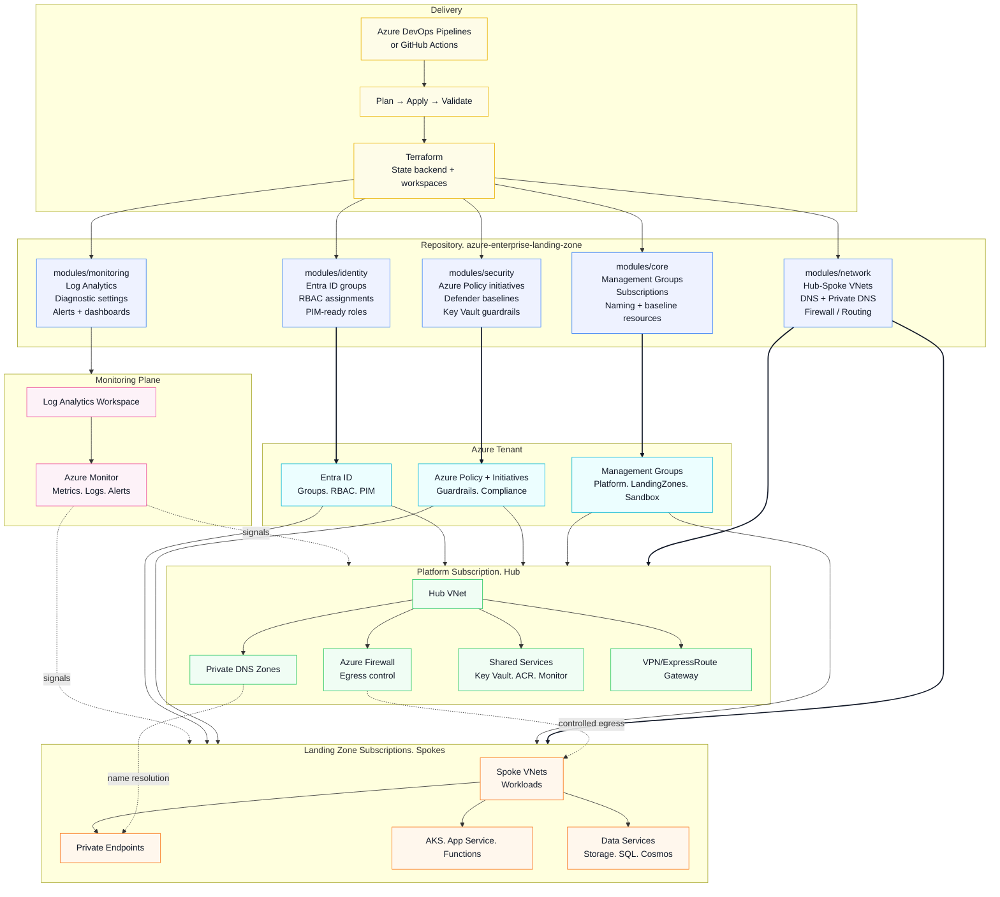
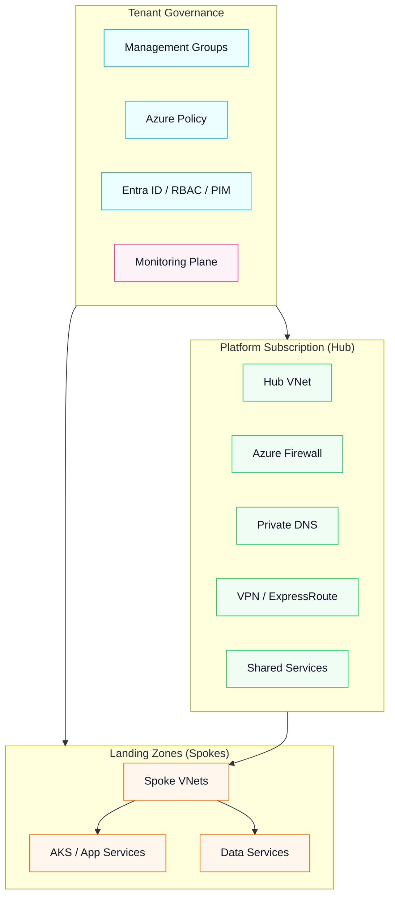

# 🌐 Azure Enterprise Landing Zone (IaC with Terraform, Azure CLI, Azure DevOps)

## Architecture

This repository contains a production-ready skeleton for deploying an **Azure Enterprise Landing Zone** using **Terraform**, **Azure CLI**, and **Azure DevOps Pipelines**. This project is ideal for showcasing your cloud infrastructure and DevOps skills.



## Governance-first Azure Enterprise Landing Zone



## 📁 Project Structure
```
azure-enterprise-landing-zone/
├── modules/                        # Reusable Terraform modules
│   ├── core/                      # Resource groups, Key Vaults, Storage
│   ├── network/                   # VNet, Subnets, NSGs
│   ├── monitoring/                # Log Analytics, Alerts
│   ├── identity/                  # Azure AD groups, role assignments
│   └── security/                  # Security Center, Policies (To-Do)
├── environments/
│   ├── dev/                       # Dev environment configuration
│   └── prod/                      # Prod environment configuration (To-Do)
├── diagrams/                      # Architecture diagrams
│   └── architecture.mmd
├── pipelines/                     # Azure DevOps pipelines
│   └── azure-pipelines.yml
├── .gitignore                     # Ignored files
├── LICENSE                        # MIT License
└── README.md                      # Project overview
```

---

## 🚀 Features
- 💠 Modular Infrastructure as Code with Terraform
- 🔐 Key Vault, RBAC, NSGs, Monitoring, and Logging
- 📡 Azure DevOps Pipeline with CI/CD for infra
- 📊 Azure Monitor Baseline Alerts (AMBA)
- 📌 Designed for real-world Enterprise Scenarios

---

## 🧰 Technologies Used
- Terraform v1.x
- Azure CLI
- Azure DevOps Pipelines
- Git + GitHub
- Markdown for documentation

---

## 🛠️ Getting Started
### Prerequisites
- Azure subscription
- Terraform & Azure CLI installed
- Azure DevOps project with service connection

### 1. Clone Repository
```bash
git clone https://github.com/gowrishacv/azure-enterprise-landing-zone.git
cd azure-enterprise-landing-zone
```

### 2. Initialize and Deploy Infra (Manual)
```bash
cd environments/dev
az login
terraform init
terraform plan -out=tfplan
terraform apply tfplan
```

### 3. Azure DevOps Pipeline
Use the `azure-pipelines.yml` file to create a new pipeline.

Set up a service connection in DevOps and name it `AzureSPNConnection` (or update in YAML).

---

## 🧱 Module Breakdown

### modules/core
```hcl
resource "azurerm_resource_group" "main" {
  name     = var.name
  location = var.location
}
```

### modules/network
```hcl
resource "azurerm_virtual_network" "vnet" {
  name                = var.vnet_name
  address_space       = var.address_space
  location            = var.location
  resource_group_name = var.resource_group_name
}
```

---

## Diagram

The architecture diagram is maintained as Mermaid source.

- Mermaid source: `diagrams/architecture.mmd`

If you want Azure product icons (Bastion, Key Vault, Policy, Firewall, etc.), GitHub Mermaid rendering does not support Azure icon packs directly.
For an icon-based diagram, export a PNG/SVG from diagrams.net (draw.io) and add it here.

- Icon-based export (optional): `diagrams/enterprise-landing-zone.png`

---

## ⚙️ Sample Pipeline (`azure-pipelines.yml`)
```yaml
trigger:
  branches:
    include:
      - main

pool:
  vmImage: 'ubuntu-latest'

steps:
  - task: AzureCLI@2
    inputs:
      azureSubscription: 'AzureSPNConnection'
      scriptType: 'bash'
      scriptLocation: 'inlineScript'
      inlineScript: |
        az account show

  - task: TerraformInstaller@1
    inputs:
      terraformVersion: 'latest'

  - task: TerraformTaskV4@4
    inputs:
      provider: 'azurerm'
      command: 'init'
      workingDirectory: '$(System.DefaultWorkingDirectory)/environments/dev'

  - task: TerraformTaskV4@4
    inputs:
      provider: 'azurerm'
      command: 'plan'
      workingDirectory: '$(System.DefaultWorkingDirectory)/environments/dev'

  - task: TerraformTaskV4@4
    inputs:
      provider: 'azurerm'
      command: 'apply'
      workingDirectory: '$(System.DefaultWorkingDirectory)/environments/dev'
      environmentServiceNameAzureRM: 'AzureSPNConnection'
```

---

## ✅ TODO
- [ ] Add Policy module with built-in & custom policies
- [ ] Add Application Gateway and Firewall module
- [ ] Integrate Azure Kubernetes Service (AKS)
- [ ] Add dynamic Terraform workspaces for multi-env

---

## 📄 License
This project is licensed under the MIT License - see the [LICENSE](./LICENSE) file for details.

---

## 🙌 Author
**Gowrisha CV**  
🔗 [LinkedIn](https://linkedin.com/in/gowrishacv)  

---

### 💬 Questions?
Open an issue or connect on LinkedIn!
